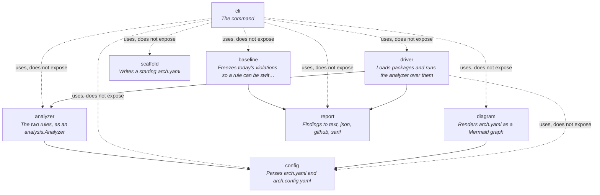

# archlint

Architecture rules for Go — including the one your linter cannot see.

Every Go architecture linter checks **imports**: which packages a layer may depend on.
archlint checks imports too, and then checks something else.

```go
package infra   // may import the driver; may not hand it out

import "gorm.io/gorm"

type Repo struct{ db *gorm.DB }

func (r *Repo) Find(id string) (*domain.Order, error)  // fine
func (r *Repo) Raw() *gorm.DB                          // ← the leak
```

That import is legitimate. `infra` owns persistence; of course it imports the driver. So
every import-based linter — [go-arch-lint], [arch-go], depguard — reports this file clean.
And it isn't: `Raw` puts a `*gorm.DB` in the hands of every caller, and now your domain is
welded to your database library through a door nobody was watching.

archlint reports it:

```
internal/infra/repo.go:24:16  error  Repo.Raw exposes gorm.io/gorm, which infra may not export  [exports]
```

## The idea

Two allowlists per component:

| | question |
|---|---|
| `imports` | what may this component **depend on**? |
| `exports` | what may appear in its **public API**? |

The second is strictly stronger, and the gap between them is where abstraction leaks live.
A repository that imports `gorm` is doing its job. A repository that *returns* `gorm` has
stopped being an abstraction.

Leaks hide in more places than a signature. archlint resolves real types, so it finds all
of these — none of which name the driver anywhere a syntax-based check would look:

```go
type Repo = gorm.DB               // alias
func Get() map[string]*gorm.DB    // map value
func List[T gorm.Model]() []T     // generic constraint
type H struct{ *gorm.DB }         // embedded field
func F(...gorm.Option)            // variadic
type S interface{ Save(*gorm.DB) } // interface method set
func Stream() <-chan gorm.DB      // channel element
```

## Install

```sh
go install github.com/ddromanidis/arch-linter/cmd/archlint@latest
```

## Use

```sh
archlint init -preset hexagonal   # write a starting arch.yaml
archlint                          # check ./...
archlint diagram                  # print the component graph as Mermaid
```

### arch.yaml — the architecture

Committed, reviewed and diffed like the design document it is.

```yaml
version: 1

components:
  domain:
    path: internal/domain/...
    description: "Entities and rules. Depends on nothing."
    imports: []
    exports: []

  infra:
    path: internal/infra/...
    imports: [domain, gorm.io/gorm]
    exports: [domain]          # note what is absent: gorm

  api:
    paths:
      - internal/api/...
      - internal/transport/...
    imports: [domain, app, net/http]
    exports: [domain]

defaults:
  imports: [fmt, errors, context]
  exports: [context, time]
```

Both lists are **allowlists**: anything named is permitted, anything else is not. A
denylist alone is only as good as your imagination on the day you wrote it, and the
dependency that hurts is the one nobody thought to ban.

**Omitting a list is not the same as emptying it.**

```yaml
domain:
  imports: []      # depends on nothing. A lockdown.

scratch:
                   # no `imports` key: unconstrained, no rule applied
```

That is what lets you adopt this a component at a time — declare the three layers you care
about, leave the rest silent — instead of every unclassified corner reporting its whole
import block on day one. It matters most for `exports`, since most components have no API
surface worth restricting and requiring each to say so was noise.

Permission to export implies permission to import — you cannot return a `time.Time` without
importing `time`. The implication runs one way only, which is the entire point. An *omitted*
`exports` grants nothing, though: it declines to check, so it cannot quietly unconstrain
the import rule beside it.

### Banning something specific

`deny` narrows what an allowlist has permitted, and beats every allow including `std`:

```yaml
components:
  worker:
    imports: [std, domain]
    deny: [os/exec]          # the whole standard library, minus one

defaults:
  deny: [unsafe]             # project-wide
```

It is the only rule that still applies to an unconstrained component, which is the
combination it exists for: *anything, except this*. Denying a package denies exposing it
too. Messages say which rule fired, because the fixes are opposite — a denied import means
deleting a line of Go, an undeclared one usually means adding a line to `arch.yaml`:

```
a/a.go:4:2  error  alpha may not import os/exec (denied)   [imports]
b/b.go:9:2  error  bravo may not import gorm.io/gorm       [imports]
```

### arch.config.yaml — the tool

Optional. It exists to change something, not to state the obvious.

```yaml
version: 1
output:
  format: text        # text | json | github | sarif
  color: auto
severity:
  imports: error
  exports: error
  waivers: warning
exclude:
  - "**/mock_*.go"
  - internal/generated/...
include-tests: false
baseline: .archlint-baseline.yaml
```

## Adopting it on code that already exists

A rule you cannot adopt is a rule nobody adopts. Turning this on for the first time in a
mature repository reports hundreds of findings, none of which anybody will fix before their
next commit lands.

**Freeze them:**

```sh
archlint baseline      # writes .archlint-baseline.yaml
```

Existing violations are forgiven; **new ones are not**. The baseline counts violations per
`(component, rule, package)` rather than per file and line, so it survives refactoring — move
every offending function to a new file and nothing is reported — while a tenth instance of
something there were nine of still fails. Fix some, re-run `archlint baseline`, and the
numbers come down.

**Or waive one:**

```go
//archlint:ignore exports the migration tool is handed the raw handle on purpose
func Migrate(db *gorm.DB) error
```

A reason is required, because an unexplained waiver is the start of a rule nobody remembers
agreeing to. Waivers that stop suppressing anything are reported, because the fix that made
one unnecessary is exactly what leaves it behind.

## Running it

Three front ends, one implementation — an `analysis.Analyzer`. They cannot disagree about
what is a violation, and a test builds two of them and compares their findings to keep that
true.

**Standalone** — full output formats, baseline, diagrams:

```sh
archlint -format github ./...
```

**go vet:**

```sh
go install github.com/ddromanidis/arch-linter/cmd/archlint-vet@latest
go vet -vettool=$(which archlint-vet) ./...
```

**golangci-lint** — a module plugin; see `.custom-gcl.yml` and `.golangci.example.yml`.
Be aware of the cost: module plugins require building a custom golangci-lint binary and
distributing it to every developer and CI runner. If that is not worth it, run `archlint`
as its own CI step — the rules are identical.

### Exit status

| | |
|---|---|
| `0` | no violations, or only warnings |
| `1` | at least one error |
| `2` | could not run — bad config, or code that does not compile |

Code that does not type-check is refused rather than analysed. Deciding whether a signature
leaks means resolving what its types are, and a half-resolved answer is exactly the
quietly-wrong result this tool exists to avoid.

## Diagrams

`arch.yaml` is executable, so a diagram generated from it cannot drift from what the build
enforces:

```sh
archlint diagram >> README.md
```

Dotted edges mark a dependency a component holds privately — imported, not re-exported.

This is archlint's own architecture, generated by the command above and enforced by its
own CI:



## Cycles

Go already refuses import cycles between **packages**. It cannot see a cycle between
**components**, because a component is several packages:

```
component app                    component support
  app/ctx.go   ───────────────▶    support/log.go
  app/user.go  ◀───────────────    support/audit.go
```

Nothing imports itself transitively, so that compiles. But `app` and `support` are now
mutually dependent, and neither can be understood, tested or extracted without the other —
which is the thing layering exists to prevent, and the compiler is structurally incapable
of noticing.

```
arch.yaml:28:1  error  dependency cycle: app → events → support → app  [cycles]
```

Checked against the *declared* graph rather than the real imports, because the declared
graph is a superset: nothing can import what it has not declared, so a config without
cycles guarantees code without them. That also means it needs no build and answers
instantly — and it is reported even when the packages fail to compile, which is exactly
when you most want to know the architecture itself is sound.

Reported by the standalone command only. A cycle is a property of `arch.yaml` rather than
of any one package, so emitting it from the per-package analyzer would repeat the same loop
once for every package in the module.

## What it does not do

- **Unclassified packages.** A package no component claims has no rules and is not
  reported; otherwise adoption would be an exercise in silencing it.
- **Test files**, unless `include-tests: true`. Tests routinely and correctly reach across
  boundaries their production code may not.

## Prior art

[go-arch-lint] and [arch-go] both do import checking well, and go-arch-lint has a richer
vocabulary for describing component graphs than this does. If import rules are all you
need, they are mature and worth using. archlint exists for the other half.

[go-arch-lint]: https://github.com/fe3dback/go-arch-lint
[arch-go]: https://github.com/arch-go/arch-go

## Licence

MIT
